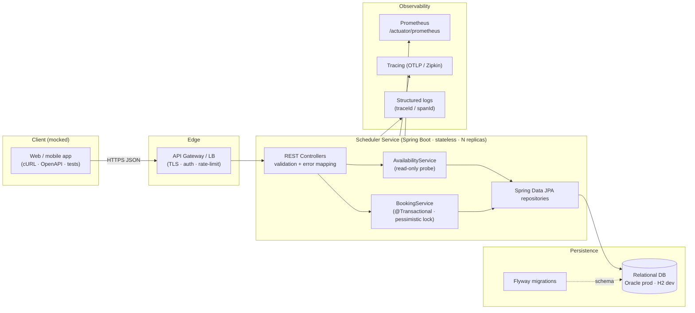
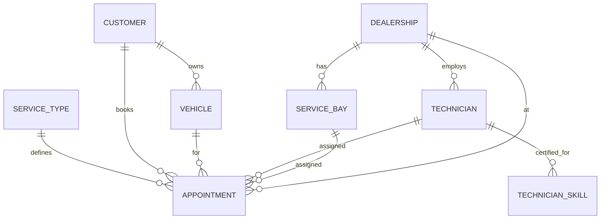
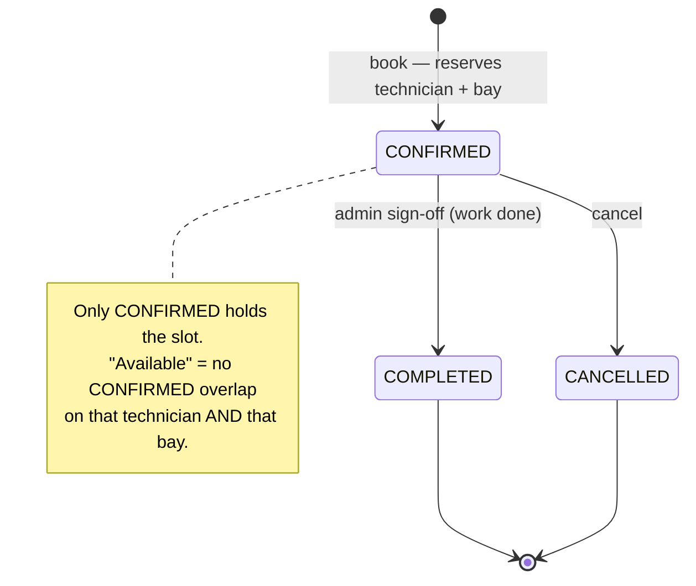
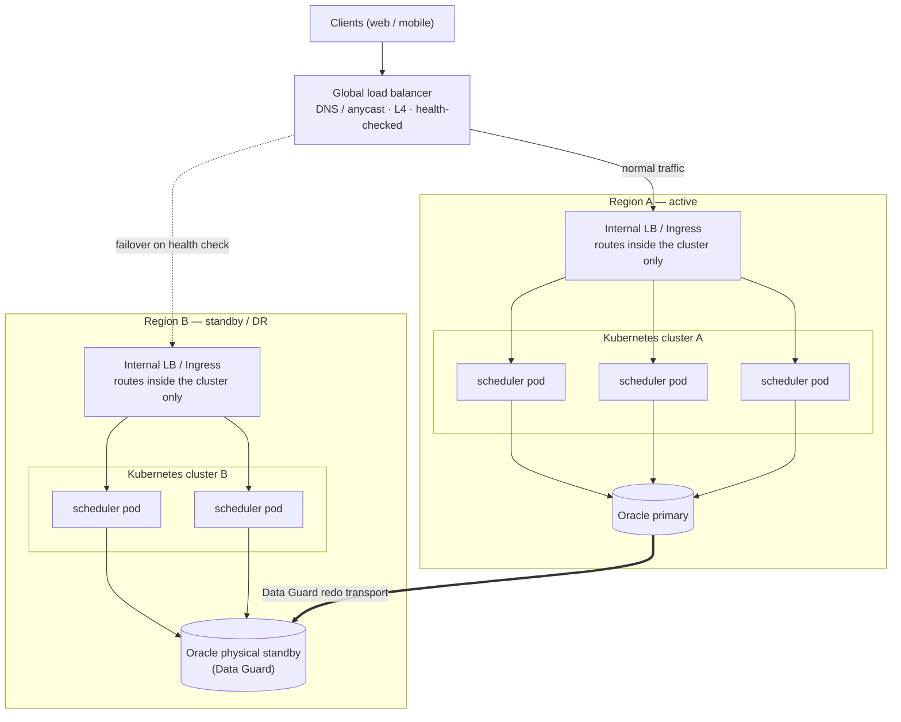

# Unified Service Scheduler — System Design Document

**Scenario A — Ownership domain.** Replace manual dealership booking with a
service that lets a customer request a service appointment for a specific
vehicle, service type, dealership and time; verifies that **both** a service bay
and a **qualified** technician are free for the whole service duration; and, on
success, persists a confirmed appointment linking customer, vehicle, technician
and bay.

Version 1.0 · Implementation: **Backend** (RESTful API + persistent DB; client
mocked via OpenAPI spec, cURL examples and a test harness).

---

## 1. Acceptance criteria → design mapping

| # | Core requirement | Where it lives |
|---|------------------|----------------|
| 1 | Resource-constrained booking request | `POST /api/v1/appointments`, `BookingRequest` (validated) |
| 2 | Real-time availability of **bay + qualified technician** for the **full duration** | `BookingService.book` + overlap queries in `TechnicianRepository` / `ServiceBayRepository`; skill match via `ServiceType.requiredSkill` ∈ `Technician.skills` |
| 3 | Persistent confirmed appointment linking all parties | `Appointment` entity (FKs to customer, vehicle, technician, bay, service type, dealership), status `CONFIRMED` |

Non-functional focus (“build for the future”): correctness under concurrency,
horizontal scalability, observability, and maintainability. See §7.

---

## 2. Architecture



### Component roles

- **API Gateway / Load Balancer** *(deployment concern, not in this repo)* —
  TLS termination, authentication, rate limiting, and fan-out across stateless
  replicas.
- **REST Controllers** (`web/`) — HTTP boundary. Bean-validate requests, translate
  domain exceptions to RFC-style JSON errors (`GlobalExceptionHandler`), and keep
  zero business logic.
- **AvailabilityService** — read-only, **non-binding** probe (`GET …/availability`)
  used by the UI to show open slots. Never reserves anything.
- **BookingService** — the transactional core (requirement 2 + 3). Locks the
  dealership row, re-checks availability, and writes the appointment atomically.
- **Repositories** (`repository/`) — Spring Data JPA. The two availability queries
  express interval overlap as a `NOT EXISTS` subquery.
- **Database** — source of truth. Schema and seed data are owned by **Flyway**,
  not Hibernate (`ddl-auto=validate`), so schema changes are reviewed and
  versioned like code.
- **Observability stack** — Actuator health, Micrometer/Prometheus metrics,
  Micrometer Tracing (trace/span ids propagated into logs).

### Domain model



A `ServiceType` carries a `durationMinutes` and a `requiredSkill`; a `Technician`
holds a set of skills. A booking is feasible only when a technician’s skills
contain the service’s `requiredSkill`.

---

## 3. Data flow — the booking path

```mermaid
sequenceDiagram
    participant Cl as Client
    participant Co as AppointmentController
    participant Bk as BookingService (@Transactional)
    participant DB as Database

    Cl->>Co: POST /api/v1/appointments {dealership, vehicle, serviceType, desiredStart}
    Co->>Co: Bean validation (non-null, future time)
    Co->>Bk: book(request)
    Bk->>DB: load ServiceType (duration, requiredSkill), Vehicle
    Bk->>DB: SELECT dealership ... FOR UPDATE   (pessimistic lock)
    Bk->>Bk: end = start + duration; check opening hours
    Bk->>DB: qualified technician free in [start,end)?  (NOT EXISTS overlap)
    Bk->>DB: service bay free in [start,end)?           (NOT EXISTS overlap)
    alt both available
        Bk->>DB: INSERT appointment (CONFIRMED)
        Bk-->>Co: AppointmentResponse
        Co-->>Cl: 201 Created + Location
    else none free
        Bk-->>Co: NoAvailabilityException
        Co-->>Cl: 409 Conflict
    end
    Note over Bk,DB: COMMIT releases the dealership lock
```

**Interval overlap rule.** Two windows overlap iff
`existing.start < requested.end AND existing.end > requested.start`
(half-open intervals, so back-to-back slots do not collide). This is the exact
predicate in both availability repositories.

### Concurrency & correctness

The naïve “check availability, then insert” is a classic check-then-act race:
two concurrent requests can both observe the last bay as free and double-book it.
The fix used here:

- `BookingService.book` runs in **one transaction** that takes two pessimistic
  write locks in a fixed order — **vehicle first, then dealership**
  (`findByIdForUpdate`).
- The **dealership lock serializes bookings per dealership**, so each request sees
  the committed effect of the previous one before it checks resources and inserts.
  Different dealerships never contend, so throughput scales horizontally by dealership.
- The **vehicle lock** makes the same-vehicle guard (below) race-safe even across
  different dealerships. Fixed lock ordering (vehicle → dealership) avoids deadlocks.
- Proven by `SchedulerIntegrationTest.concurrentBookingsForSameSlot…`: 8 threads
  (distinct vehicles) hit the same slot with capacity 2 → exactly 2 confirmed,
  6 rejected, never 3.

**Same-vehicle guard (duplicate booking).** Beyond not over-booking *resources*,
a vehicle can only be serviced in one place at a time. Before reserving, the
booking checks — with the same half-open overlap predicate — whether the vehicle
already has a CONFIRMED appointment in the window, and rejects with **409** if so
(`DuplicateBookingException`). Because the vehicle row is locked for the
transaction, two concurrent requests for the same vehicle are serialized and
cannot both pass.

Trade-off and alternatives (documented for reviewers):
- *Chosen:* coarse per-dealership pessimistic lock — simplest thing that is
  provably correct; contention is naturally low (bookings per dealership/second).
- *Finer-grained:* lock only the specific technician + bay rows with
  `SELECT ... FOR UPDATE` (well supported by Oracle) instead of the coarser
  per-dealership lock. Better peak concurrency, more complexity.
- *Optimistic:* `@Version` + retry — good when contention is rare.

### Appointment lifecycle & slot release

A slot is **not** freed by the clock — it is freed by a **status transition**. A
booking is created `CONFIRMED`, which is the only status the availability queries
count. When the work is done, the dealership's service desk records the
**technician sign-off** (→ `COMPLETED`); a booking can also be `CANCELLED`. Either
transition moves the appointment out of `CONFIRMED`, so that technician + bay are
immediately available again for the window.



The **admin console** (`/admin`) is where staff drive this: sign-off is the
operational answer to "is this slot still occupied?". There is no login in the
sample — staff pick their dealership (a stand-in for a per-location staff account)
and see and manage only that location's requests.

---

## 4. API surface

| Method | Path | Purpose | Success | Failure |
|--------|------|---------|---------|---------|
| POST | `/api/v1/appointments` | Book (requirements 1–3) | 201 + `Location` | 400 validation · 404 missing ref · 409 no availability · 409 duplicate vehicle · 422 outside hours |
| GET | `/api/v1/appointments/{id}` | Fetch appointment | 200 | 404 |
| GET | `/api/v1/appointments/availability` | Non-binding probe (one window) | 200 | 404 |
| GET | `/api/v1/appointments/slots` | Day view of 30-min starts (powers the UI) | 200 | 404 |
| GET | `/api/v1/customers` | Account picker (demo, no auth) | 200 | — |
| GET | `/api/v1/dealerships`, `/service-types`, `/vehicles?customerId=` | Reference data (vehicles scope to a customer) | 200 | — |
| GET | `/api/v1/admin/appointments?dealershipId=&status=` | Service-desk: list a location's requests | 200 | — |
| POST | `/api/v1/admin/appointments/{id}/complete` | Technician sign-off → releases the slot | 200 | 404 · 422 not CONFIRMED |
| POST | `/api/v1/admin/appointments/{id}/cancel` | Cancel → releases the slot | 200 | 404 · 422 not CONFIRMED |

A **Quick-Book front-end** (`src/main/resources/static/index.html`, served at
`/`) demonstrates the user experience — a service-first flow (service →
nearest/usual dealership → open slot → confirm) **wired to the live API**. It
lists real dealerships/services/vehicles, computes distance from stored
coordinates (haversine), reads day availability from `GET /appointments/slots`,
and books via `POST /appointments` — so it exercises the same skill-match,
duration and resource-capacity rules the backend enforces (and shows a 409 if a
slot is taken between load and booking). An account picker in the header
(`GET /customers`) scopes the vehicle list to the selected customer
(`GET /vehicles?customerId=`) — a stand-in for the authenticated principal that,
in production, the gateway would supply so a user only ever sees their own vehicles.

Machine-readable contract: [`docs/openapi.json`](./openapi.json) (also served live
at `/v3/api-docs`, with Swagger UI at `/swagger-ui.html`). Error bodies share one
shape (`ErrorResponse`: `timestamp, status, error, message, path, fieldErrors?`).

---

## 5. Technology choices & justification

| Choice | Why | Trade-off considered |
|--------|-----|----------------------|
| **Java 21 + Spring Boot 3.5** | Mature ecosystem for transactional REST; virtual-thread ready; team familiarity | Heavier than Go/Node, but the transactional/JPA story is a direct fit |
| **Spring Data JPA / Hibernate** | Declarative repositories; the overlap check is a small JPQL query; portable across H2/Oracle | Hides SQL — mitigated by explicit indexes and reviewing generated queries |
| **Oracle Database (prod), H2 file (dev/test)** | Oracle gives strong transactional guarantees, row-level locking, and mature high-availability/DR tooling (Data Guard, RAC); H2 keeps the sample **runnable with zero setup** | SQLite/NoSQL rejected — booking needs ACID + relational integrity |
| **Flyway** | Versioned, reviewable schema; `ddl-auto=validate` prevents drift | Slightly more ceremony than auto-DDL — deliberate for production safety |
| **Bean Validation** | Declarative request rules at the edge | — |
| **springdoc-openapi** | Contract generated from code → stays in sync; Swagger UI as the “mock client” | — |
| **Actuator + Micrometer (Prometheus) + Micrometer Tracing** | Standard, vendor-neutral observability wiring | — |
| **JUnit 5 + Mockito + MockMvc** | Fast unit tests, web-slice tests, and a real-DB integration/concurrency test | — |
| **Maven Wrapper** | Reproducible build with no global Maven install | — |

---

## 6. Observability strategy

- **Logging** — structured, with **trace/span correlation ids** injected into the
  log pattern via Micrometer Tracing (`%X{traceId}/%X{spanId}`). Each successful
  booking logs appointment id, dealership, service type, technician, bay and
  window at INFO; unhandled errors log once with stack trace in the handler.
- **Metrics** — `/actuator/prometheus` exposes JVM, HTTP server (`http.server.requests`
  — latency histograms, status codes per endpoint), HikariCP pool, and JPA
  metrics. Recommended business metrics to add: `bookings.confirmed`,
  `bookings.rejected{reason}`, and booking latency timer — a few lines with
  `MeterRegistry`, giving conversion and saturation signals.
- **Tracing** — Micrometer Tracing (Brave bridge) creates a span per request and
  propagates context to the DB call; export to Zipkin/Tempo via OTLP in prod.
- **Health** — `/actuator/health` with a DB readiness check (liveness/readiness
  split for Kubernetes probes).
- **The golden signals** map cleanly: latency (HTTP timer), traffic (request
  count), errors (4xx/5xx counters), saturation (pool + JVM gauges).

---

## 7. Building for the future

- **Scalability** — the service is **stateless**; scale by adding replicas behind
  the load balancer. Booking contention is isolated per dealership, so effective
  write concurrency grows with the number of dealerships. The DB is the shared
  bottleneck → connection pooling (Hikari), read replicas for availability probes,
  and later partitioning/sharding by dealership or region.
- **Performance** — availability is a single indexed `NOT EXISTS` query; composite
  indexes `(technician_id, start_time, end_time)` and `(service_bay_id, start_time,
  end_time)` back it. Probes are read-only and cacheable at the edge.
- **Reliability** — ACID transactions; Flyway-controlled schema; graceful,
  uniform error contract; idempotency key on booking (future) to make retries safe.
- **Maintainability** — clean layering (web → service → repository → domain), DTOs
  decoupled from entities, one exception→status mapping, generated API contract,
  and a layered test pyramid (unit / slice / integration).
- **Security** (deployment) — authN/Z at the gateway; the service trusts an
  authenticated principal and would scope bookings to the caller’s customer id.
- **Supply chain** — dependencies are scanned (Trivy) in CI; the Spring Boot BOM
  is kept current and individual transitives are pinned to CVE-patched versions
  via BOM override properties in `pom.xml` (each pin comments the CVEs it clears).
  Secrets stay out of source: DB credentials come from environment variables in
  the production datasource profile.

### Roadmap (not implemented)
Appointment reschedule (move to another slot) · real staff/customer auth ·
idempotency keys · technician shift calendars & breaks · multi-slot search
(“next available”) · outbox + events (`AppointmentConfirmed`) for notifications ·
a database-level overlap guard as defense-in-depth.

---

## 8. Deployment topology & disaster recovery

The service is **stateless**, so it runs as several replicas (pods) inside a
Kubernetes cluster fronted by an **internal load balancer** (a Kubernetes
Service / Ingress) that only routes traffic *within* that cluster. For resilience
we run **two clusters in two regions**, and a **network-level global load
balancer** (DNS/anycast, L4, health-checked) routes external traffic across them.



**Two-tier load balancing.** The global LB is the only externally-reachable
entry point and decides *which region* serves a request; the internal LB inside
each cluster decides *which pod*. They are separate concerns — the internal LB is
never exposed outside Kubernetes.

**Database & failover (active–passive with Oracle Data Guard).** Region A holds
the **primary**; **Oracle Data Guard** ships redo to a **physical standby** in
Region B, kept continuously in sync. Running Data Guard in **Maximum Availability**
(SYNC redo transport) gives a near-zero RPO without sacrificing primary
availability if the standby is briefly unreachable. Normally all write traffic
goes to A. If A's health checks fail, **Fast-Start Failover** (an observer
promotes the standby automatically) activates Region B and the global LB drains
traffic to it — a low RTO with no manual step. Optionally each region runs Oracle
**RAC** for intra-region node redundancy, with Data Guard covering the cross-region
disaster case. Because bookings need a single writer, this active–passive shape
(one open primary at a time) preserves the correctness guarantees from §3; an
active–active variant would need conflict-free write routing (e.g. sharding
bookings by dealership/region). Flyway runs the identical migrations per
deployment, so both regions share one schema version.

---

## 9. How GenAI assisted the design phase

GenAI (Claude) was used as a **design and implementation accelerator**, with all
output reviewed and validated (the build is green and the concurrency guarantee
is proven by test):

- **Requirement decomposition** — turned the scenario prose into the acceptance-
  criteria → design table (§1) and the domain/ER model, surfacing the implicit
  “qualified technician” = skill-matching constraint early.
- **Concurrency reasoning** — prompted for the failure modes of check-then-act
  booking and the spectrum of fixes (pessimistic lock, optimistic `@Version`,
  database-level overlap constraints). I chose the per-dealership pessimistic lock
  for provable correctness with low complexity, and captured the trade-offs in §3.
- **Interval-overlap correctness** — used AI to sanity-check the half-open overlap
  predicate (`start < end AND end > start`) so back-to-back slots don’t false-conflict.
- **Boilerplate acceleration** — generated entities, DTOs, repositories, the
  exception→HTTP mapping, Flyway DDL/seed, and the test scaffolding, which I then
  refined for naming, nullability and portability.
- **Test design** — AI proposed the concurrency test shape (latch-gated threads
  asserting “successes == capacity”), which became the key correctness proof.
- **Bug caught in review** — a live smoke test revealed a timezone shift
  (`hibernate.jdbc.time_zone=UTC` skewing zone-less `LocalTime`/`LocalDateTime`);
  AI diagnosed the shadowed-config root cause and the fix.

**Guardrails.** AI suggestions were treated as drafts: every claim is backed by a
passing test or a live run, generated SQL/queries were read for correctness and
indexing, and design trade-offs were decided deliberately rather than accepted by
default.
